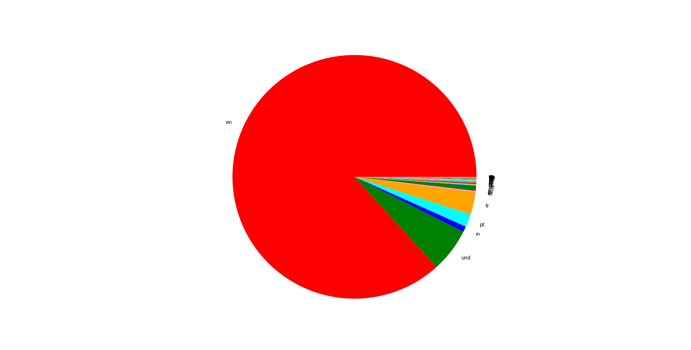
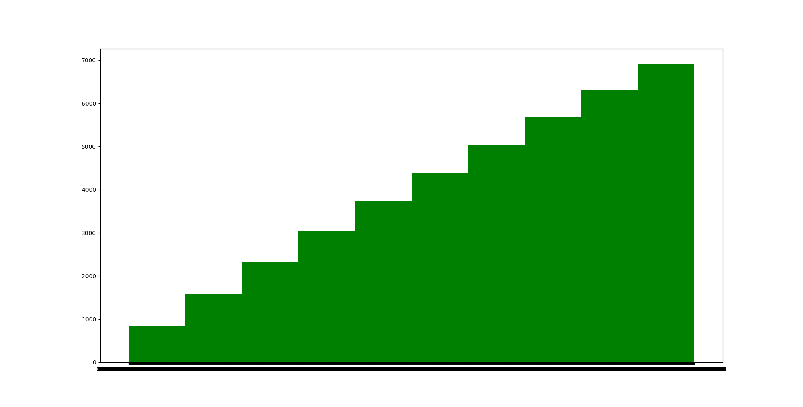
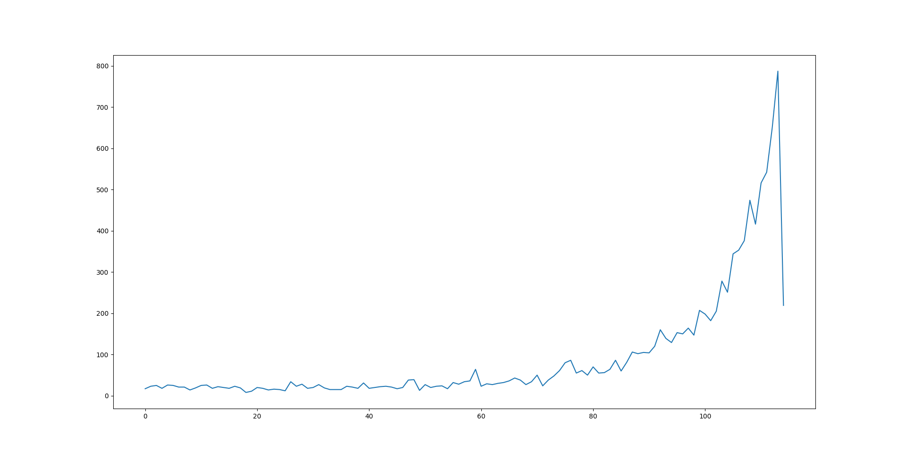

# REPORT - TWITTER ANALYTICS


## Finding top 10 trends of Delhi region

We use the script `findtrends.py` to extract the top 10 trending tweets and saves them in a text file with date-and time stamp.

## Extraction of Top trend

We use tweepy to extract tweets and save them to a csv file. I have also written script to convert the csv database to json file and then we can add it to mongoDB using 

```bash
$  mongoimport -d mydb -c mycollection --file < tweetDump.json
```

I felt only data essential to my analysis needed to be saved and thus I saved only certain columns in the Database. They are : 

1. Timestamp of the tweet
2. Tweet Text
3. Username 
4. Number of likes
5. Number of retweets
6. Location 
7. Number of users, the person tweeted is following
8. Number of users, following the user tweeted
9. Language tweeted in 
10. Location
11. About the person who tweeted

Now these are saved in csv and then converted to json. This json file can be exported as mongoDB database.

### `Also, consider this that the csv file will be given as input to the portion that does data analysis and generates plots.`


## Data Analysis

### 1. Language Analysis

We have analysed languages and created a PIE chart for showing the languages in which most tweets were done. 




We see : 

1. Most tweets are in English language.
2. We can see that frequency of each language follows near hyperbolic distribution.

Flaw : 

1. Twitter cannot recognize languages like Hindi, when tweeted in English script,   
like : `yeh hindi me likha hai`.   
This not only increases the number of english recorded tweets, but also decrease the hindi or other language tweets from the actual number.

### User Analysis - Influence of user tweets

We wanted to see how influential the tweet is in the sphere of influence of the user. For this we use the following data : 

1. More number of retweets and likes implies that the topic is very likely to be influencing the peer of user.
2. This number itself is not normalized. For an example, a user with 100 followers and 80 retweets for his tweet has more influence of the topic in his peer than a user with 1000 followers and 100 retweets.

Thus we form the following formula : 

`&alpha; = &omega; / (&Sigma; (&lambda; + &tau;))  `

&omega; = Number of followers   
&lambda; = Likes    
&tau; = Retweets




Notice that the lower value of this property means the user is more influential about the particular tweet in their peer. It is only natural that influence is almost linearly increasing with number of users.

That is y-value is low, i.e. more influential tweet is true for small number of users.


### Location analysis

I also tried to do Location analysis but it proved difficult. I have noted down the basic problems : 

1. The location of user tweeting is based on what he/she writes in his/her description. It is potential source of ambiguity, as : 

`user form new york can write : NYC or New York or tri-state` etc.

2. The string can have differences other than name variations also, like :  
`new-york`  
`New York`  
`NewYork`   

3. Vicinity cannot be translated here. As an example:

if there are 1000 tweets from `Delhi`, 1000 from `New Delhi`, 1000 from `Noida` and 1000 from `Gurgaon` and on the other hand, there are `2000` tweets from Hyderabad, then the analysis translates to the fact that the topic is more trending in Hyderabad, while actually its trending in Delhi-NCR region.

### Trend Analysis

I also thought to see how the topic has picked up with time, so I took number of tweets is every 5 minutes intervals and plotted it to see the trend.



This shows the following conclusions that the trend can be in one of the three stages : 

1. Peaked : means, trend has already, reached its peak and will now decrease its trend.
2. Increasing : this means the trend will increase further till its peaks in future
3. Peaking : means the trend is at its peak currently 

In the following plot, we need to ignore the last point that is exceptionally lower, because, it has tweets of less than 5 minutes (till present)

### Bot-Detection 


Using tweepy we can also detect bots. I have read on some papers and blogs for different opinions on criteria for bots, but I decided to come up with my own criteria, which are :  
1. `probBot += w_fc * (100/log(Follower_count,4))`    
w_fc is weight of follwer_count  [30 %]
WWW
2. FOR likes, we can use ( number of likes + number of retweets ) / number of tweets as a potential sign for a bot
`probBot += [10]*(number of likes + number of retweets + 1)/(number of tweets + 1)`   Special case for no retweets
3. Language independence implies more bot-like nature [multi-lingual tweets more equi-distributed]
4. humans have non-zero length of description  ,humans usually have urls in description
5. lists/ moments etc. absent is a slight indicator of bots (less weighted)    
6. skewed distributed tweet on timeline is a significant indicator of bots
7. check time-zone of tweeting anything. If randomly distributed than high prob of it being a bot.

Notice point `2` which derives its motivation from the fact that if a user makes more likes and retweets than tweets, it is likely to be increasing a trend, which is primary task of bots, while near equal distribution of likes/retweets and tweets means a more general self-motivated use of twitter like users.


Flaw : 
1. The rating of being bot is not normalized, so while the greater rating means higher chance of being a bot, there has not been a fixed range over which this distribution is defined. This is due to lack of required mathematical insight to make such a distribution and I am currently on the lookout to convert this distribution to % based distribution.