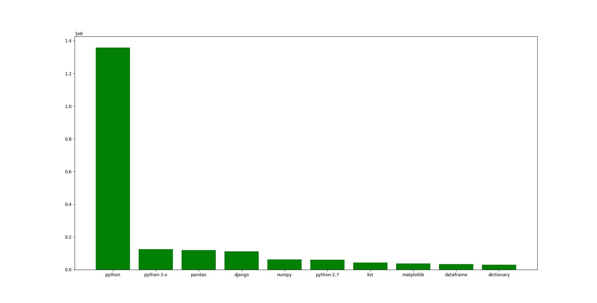
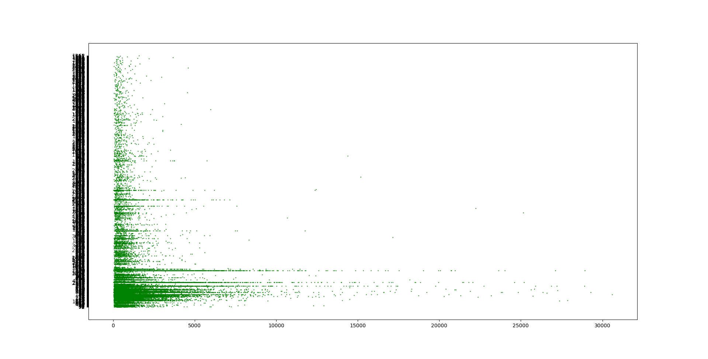
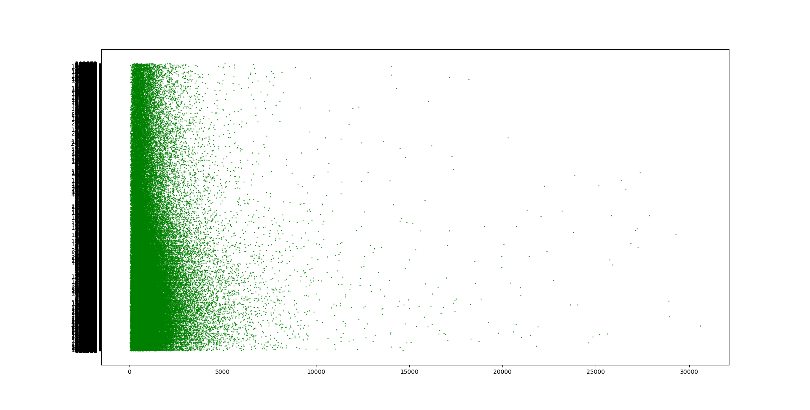
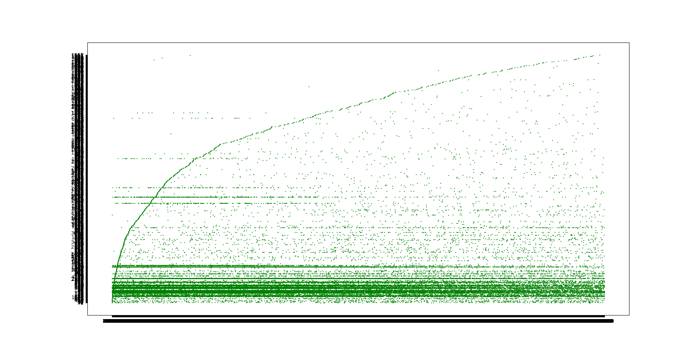

# REPORT FOR TASK 3 Part b

We needed 2-types of database

1. Frequency of tags in posts, obtainable from scraping Posts.xml

We used script `newScript.py` to extract the data. The hurdle of huge dataset size (5GB+) was tackled by using `lxml` library of python. It uses tree-data structure and deletes parsed nodes on the go.

2. Next is for analytical purposes and we have to extract for each post the following :     length of post,number of views, number of upvotes/score of post.

We use script `analysisScript.py` to achieve this task. The basic code for both is same and we have just changed the function `addAttr` to achieve this task. The database is saved in `extemp.json` and since it is a file of large size (>10MB) we compress it to `extemp_json.zip` to submit it on github.


## WordCloud 

Tech used : wordcloud package from python
```bash
$ pip3 install wordcloud
$ wordcloud_cli --text <textfile.txt> --imagefile wordcloud1.png
```
We used `sample.json` as frequency dictionary to generate a text-file containing proportional number of words to its occurrences as tags in original database.
  
Following is the wordcloud


## Bar-Plot

We have used data from `sample.json` to plot bar graph. The code is trivial and could be done via python cli, but it has been submitted under `plotter.py`.




The analysis shows that the distribution has near asymptotic distribution of tag python. I feel it follows hyperbolic distribution (xy = c).

## Analysis of Data and additional inferences


### Score vs Length Plot 

We see how score of a post varies with length of post in the following graph.


Notice that score is on Y-axis and Length is on Y-axis

The distribution looks like y-oriented normal distribution with the mean understandably shifted to +y (+ve mean)


### Views vs Length graphs



Notice that views is on y-axis and length is on x-axis


It seems no interesting observations can be drawn from this plot, but on a more careful look, it seems to some extent, smaller posts have equal distribution for more and less views, but large posts have shift towards less number of views.

### Score vs Views graph

I next felt there might be some relation between score of post and views, which is a better reflection of the usefulness of the post. 



Note score of posts in on y-axis and views is on x-axis

This implies following conclusions:

1. Generally posts have similar number of likes/upvotes, that is very low. It is because normally, people tend to not view posts that are secondary or later, but just the most upvoted post.
2. There is a parabolic graph showing the most popular post, which is proportional to square-root of number of views. This is in general the most popular post, because, it acts as a closed parabolic curve for most of the points, that lie in the area enclosed by this and the x-axis.

